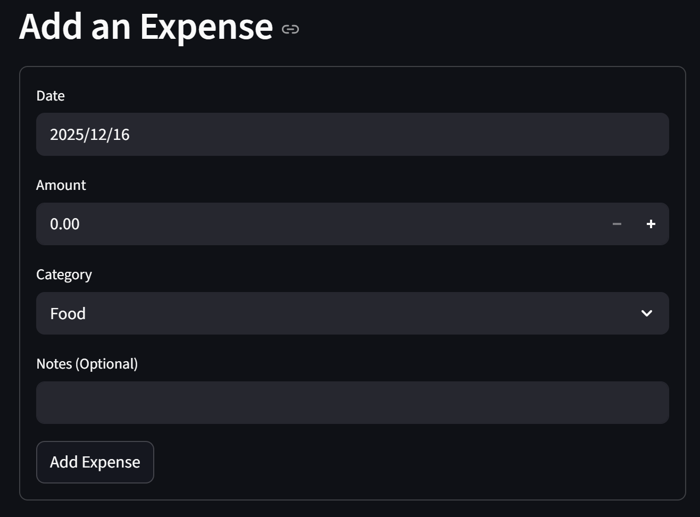
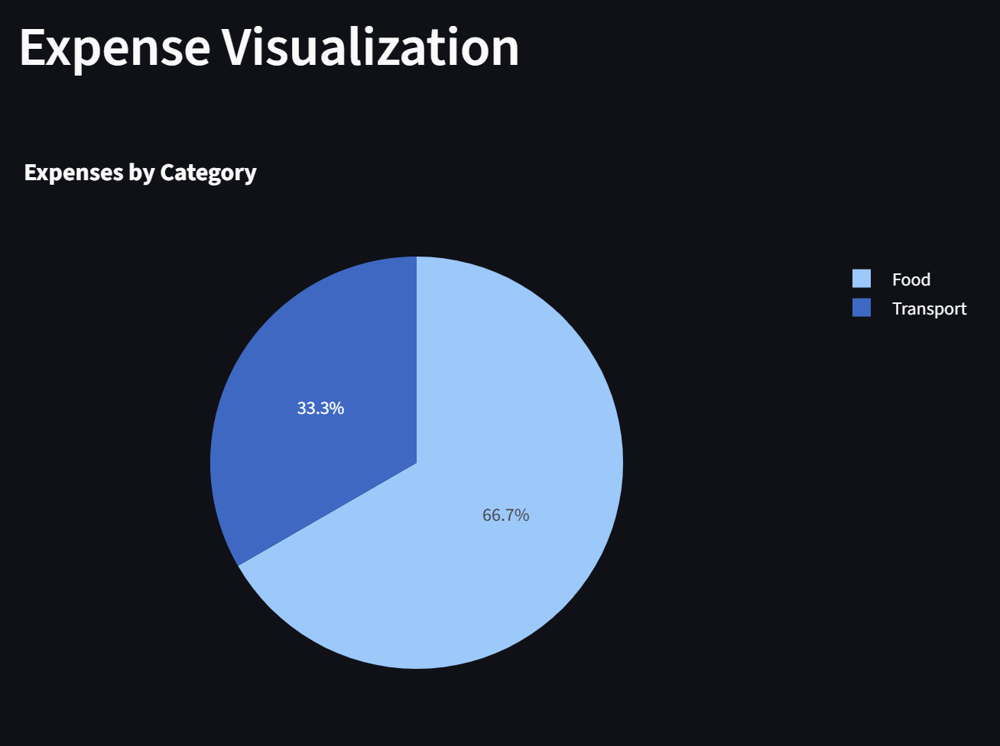
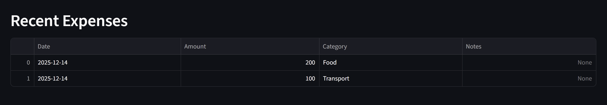

# 費用追蹤與視覺化系統 (Expense Tracking and Visualization System)

## 專案概述 (Project Overview)

這是一個基於 Python Streamlit 框架開發的輕量級網頁費用追蹤工具
它允許使用者透過直觀的網頁介面輸入日常開支的金額、類別和日期，並即時完成以下操作：

1.  **視覺化分析**：即時生成並顯示費用的圓餅圖 (Pie Chart)，清晰展示各類別的支出分佈。
2.  **資料持久化**：所有輸入的費用紀錄會自動儲存至 `expenses.csv` 文件，便於資料的長期管理和分析。
3.  **近期開銷顯示**：在介面底部顯示最近的開銷紀錄，方便使用者快速回顧。

## 專案功能 (Features)

*   **互動式網頁輸入**：提供友善的網頁表單，方便輸入費用金額、類別和日期。
*   **即時視覺化**：使用 Plotly 繪製交互式圓餅圖，自動更新以反映最新的費用分佈。
*   **數據持久化**：所有費用資料自動同步寫入 `expenses.csv` 文件。
*   **近期紀錄一覽**：顯示最近 10 筆費用紀錄。
*   **中文支援**：確保介面和圖表能正確顯示中文字符。
*   **Excel 兼容性**：CSV 文件使用 `utf-8-sig` 編碼 (如果適用，需確認程式碼是否如此)，以確保在 Windows 環境下使用 Excel 雙擊開啟時，中文字符能正確顯示。

## 環境設定與依賴 (Setup and Dependencies)

### 1. 必備環境
您需要安裝 Python 3.x。

### 2. 安裝依賴庫
本專案需要 `streamlit`、`pandas` 和 `plotly` 庫來運行網頁應用和繪製圖表。請打開您的終端機或命令提示字元，執行以下指令：

```bash
pip install streamlit pandas plotly
```

### 3. 中文字型 (Optional)
為確保 Streamlit 應用和圖表上的中文標題和內容能正確顯示，請確認您的作業系統已安裝相關中文字型。在某些環境下，Streamlit 和 Plotly 可能會自動處理字型，但若遇到顯示問題，可能需要額外配置。

## 執行步驟 (How to Run)

### 1. 啟動程式
在專案根目錄下，打開終端機或命令提示字元，執行主程式：

```bash
streamlit run app.py
```

### 2. 使用介面
程式啟動後，會自動在您的瀏覽器中打開 Streamlit 應用。您可以在左側的輸入欄位中填寫費用資訊，並觀察右側的圓餅圖和近期開銷紀錄的變化。

- 左側輸入欄位
   
- 右側收支圓餅圖
   
- 底部近期開銷 (10 筆)
   

## 輸出文件 (Output Files)

程式運行後將會更新或生成以下文件：

*   **`expenses.csv`**: 包含所有輸入費用紀錄的表格數據。

## Demo Video

[](https://www.youtube.com/watch?v=awU7GOSQpE8)

